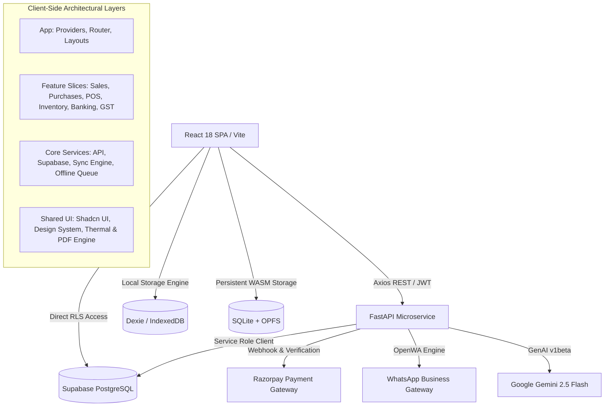

# RupayBill — Production Architecture Specification

## 1. Executive Summary

RupayBill is a production-grade, offline-first billing, inventory, and GST compliance SaaS engineered for Indian merchants and SMEs. The platform operates on a dual-engine architecture:
- **Cloud Layer**: Supabase PostgreSQL with strict Row-Level Security (RLS), real-time change streams, and a Python FastAPI microservice handling authoritative invoice generation, GSTR calculations, and payment webhooks.
- **Client & Edge Layer**: React 18 SPA bundled with Vite, TanStack Query v5 for intelligent offline-first caching, and a multi-tiered local persistence engine (Dexie IndexedDB, OPFS, and SQLite via WASM) with background two-way synchronization.

---

## 2. System Architecture Diagram

---

## 3. Core Architectural Principles

1. **Domain-Driven Feature Isolation**:
   Business logic, components, dialogs, hooks, and types are localized to their functional domain (e.g., `features/sales`, `features/pos`, `features/banking`) rather than pooled into monolithic global folders.

2. **Layered Separation of Responsibilities**:
   - **Presentation Layer (`components/`, `pages/`)**: Pure rendering, local UI state, user event capture, error/loading skeletons. Zero direct database mutation logic.
   - **Application Layer (`hooks/`)**: TanStack Query wrappers, optimistic updates, query invalidation, and UI orchestration.
   - **Domain / Business Layer (`services/`, `utils/`)**: Financial calculations, GST tax matrices, payment transcript parsers, validation schemas.
   - **Infrastructure Layer (`core/api/`, `core/offline/`, `core/integrations/`)**: Network clients, token interceptors, IndexedDB adapters, offline synchronization pipelines.

3. **Financial Invariant Preservation**:
   All monetary values, GST splits (CGST, SGST, IGST), discounts, round-offs, customer receivables, and vendor payables follow strict immutable accounting formulas.

4. **Offline-First Synchronization Pipeline**:
   Mutations are captured locally in the offline queue, persisted to IndexedDB/SQLite, and replayed idempotently with server reconciliation upon network restoration.
