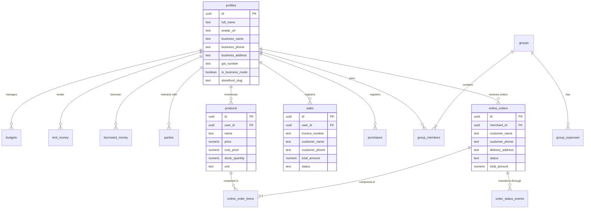

# Database Schema & Security

FinFlow Tracker utilizes a highly relational and secured schema on PostgreSQL (powered by Supabase). Below is a detailed map of the database tables, relations, security architecture (RLS), and custom database RPC (Remote Procedure Call) functions.

---

## 📊 Entity Relationship Diagram (ERD)

The diagram below represents how different domains in FinFlow (Users, Personal Finance, Groups, Business Mode, and E-Commerce Storefront) connect at the database level.



---

## 🗂️ Core Tables Detail

### 1. `profiles`
Extends the native `auth.users` table with user profile settings and merchant registration info.

| Column | Type | Nullable | Description |
| :--- | :--- | :--- | :--- |
| `id` | `uuid` | NO (PK) | Links directly to `auth.users.id` |
| `full_name` | `text` | YES | Display name of the user |
| `avatar_url` | `text` | YES | Link to avatar image in storage bucket |
| `is_business_mode` | `boolean` | NO | Toggles business dashboard view (Default: `false`) |
| `business_name` | `text` | YES | Legal business/shop name |
| `business_phone` | `text` | YES | Business phone for orders & invoicing |
| `business_address`| `text` | YES | Physical store address |
| `gst_number` | `text` | YES | Tax Identification Number (15-character GSTIN) |
| `storefront_slug` | `text` | YES (Unique)| Subdomain slug (e.g. `/store/slug`) |

### 2. `products`
Stores inventory stock catalog items for merchants.

| Column | Type | Nullable | Description |
| :--- | :--- | :--- | :--- |
| `id` | `uuid` | NO (PK) | Auto-generated product identifier |
| `user_id` | `uuid` | NO (FK) | Reference to `auth.users.id` (product owner) |
| `name` | `text` | NO | Product title/label |
| `price` | `numeric` | NO | Selling price to customer |
| `cost_price` | `numeric` | NO | Purchase/cost price from vendor |
| `stock_quantity` | `numeric` | NO | Remaining stock levels |
| `unit` | `text` | NO | Metrics scale (e.g., pcs, kg, boxes, bags) |

### 3. `online_orders` & `online_order_items`
Tracks customer purchases placed through public digital storefronts.

#### `online_orders` table:
| Column | Type | Description |
| :--- | :--- | :--- |
| `id` | `uuid` (PK) | Unique Order ID |
| `merchant_id` | `uuid` (FK) | Ref to `profiles.id` (the merchant receiving the order) |
| `customer_name` | `text` | Customer's full name |
| `customer_phone` | `text` | Phone number for contact/verification |
| `total_amount` | `numeric` | Total cost including delivery fee |
| `status` | `text` | Status constraint: `pending`, `processing`, `delivered`, `cancelled` |

---

## 🔒 Row-Level Security (RLS) Policies

Row-Level Security is strictly enforced. No client can access records of another user unless explicitly authorized by membership rules.

### Generic Personal Tables (`expenses`, `budgets`, `lent_money`, `borrowed_money`)
*   **Select/Insert/Update/Delete Policy**:
    ```sql
    auth.uid() = user_id
    ```
    *Enforces that only the creator of the transaction can view or edit the record.*

### Groups Splitting System (`groups`, `group_members`, `group_expenses`)
Security is resolved based on membership relations:
1.  **Group Access**:
    *   A user can select a row in `groups` if their ID exists as a verified record in `group_members` for that group.
2.  **Expense Access**:
    *   A user can view/create an expense in `group_expenses` if they are a member of the group.
    *   A user can only delete/edit a row in `group_expenses` if `created_by = auth.uid()`.

### E-Commerce Storefront (`products`, `online_orders`)
The storefront is unique because public customers need to view products and place orders without logging into the merchant's private admin account.
1.  **Products Public View**:
    *   Allows **anonymous/public select** on `products` so shoppers can browse.
    *   Write/Update access remains restricted strictly to the product owner: `auth.uid() = user_id`.
2.  **Online Orders Public Write**:
    *   Allows **public insert** access to `online_orders` & `online_order_items` (so customers can submit a cart checkout).
    *   Merchant is notified immediately, and only the merchant has `SELECT` or `UPDATE` access to fulfill orders.

---

## ⚙️ Custom PostgreSQL RPC Functions & Triggers

### 1. Stock Deduction Trigger
Automatically decrements product inventory when online orders are marked as `processing` or `completed`.
*   **Database Trigger**: `after_order_status_update`
*   **Function**: `deduct_product_inventory()`
    *   Ensures stock levels remain accurate without requiring manual dashboard adjustments by the merchant.

### 2. Smart Search & Recommendations RPC
*   **Function Name**: `get_product_recommendations(target_product_uuid)`
    *   Uses historical correlation maps (`product_correlations`) of items commonly bought together in checkout carts. Returns recommendations dynamically.

### 3. Admin Users Fetch RPC
*   **Function Name**: `get_admin_users()`
    *   Bypasses typical RLS limits using a secure `SECURITY DEFINER` setup to aggregate user accounts and active business flags on the master Admin dashboard.
    
