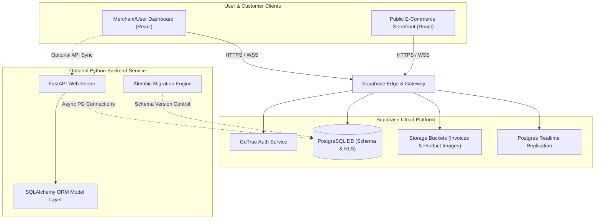

# Product Overview & Architecture

Welcome to **FinFlow Tracker** , a modern, comprehensive, and high-performance financial management ecosystem. FinFlow is designed to be the ultimate dual-purpose financial ledger—serving both individual users (personal expense tracking, group split calculations, peer loans) and small-to-medium merchants (GST-compliant sales and purchases bookkeeping, live inventory control, customer relations, and instant public digital storefronts).

---

## 🌟 The Vision
Most financial trackers force a division between **personal finance** and **business ledgering**. FinFlow bridges this gap:
1.  **For Individuals**: A slick, intuitive, and modern portal to upload receipts, split bills with roommates, track lent/borrowed money, and analyze personal spending.
2.  **For Businesses**: A full-scale micro-ERP system. A merchant can enable "Business Mode" to unlock inventory tracking, parties directory (customer/supplier CRM), Sales/Purchases journals, a PDF Print Studio, and launch an active digital store in seconds.

---

## 🏗️ High-Level System Architecture

FinFlow is designed around a decoupled, cloud-first architecture optimized for speed, reliability, offline resilience, and real-time database state synchronization.



### Architectural Pillars:
*   **Offline-First Query Caching**: Integrates `@tanstack/react-query` with persistence layers to cache queries. Even if connection drops, the app loads immediately and responds dynamically.
*   **Real-time Synchronization**: Uses Supabase Realtime (WebSockets) to synchronize storefront orders and inventory stock levels instantly between the customer storefront and merchant dashboard.
*   **Row-Level Security (RLS)**: Every single table in the PostgreSQL database is secured using context-aware RLS policies. A user can only read and write data that belongs to them or groups they are verified members of.
*   **Modular Component Organization**: Divided strictly by "features" to ensure frontend code remains clean, testable, and highly decoupled.

---

## 🛠️ Technology Stack

FinFlow is built with modern, industry-standard technologies:

| Layer | Technology | Purpose |
| :--- | :--- | :--- |
| **Frontend Core** | React 18, TypeScript, Vite | Fast compilation, component modularity, and strict type safety. |
| **Styling** | Tailwind CSS, CSS Variables | Responsive, utility-driven layout with custom color systems. |
| **UI Components** | Radix UI, shadcn/ui | Accessible, customizable components (dialogs, charts, selects). |
| **State & Cache** | TanStack Query (React Query) | Server state management, auto-refetching, and cache optimization. |
| **Database & Auth** | Supabase, PostgreSQL | Relational storage, Real-time channels, Row Level Security. |
| **Storage** | Supabase Storage | File storage for invoices, receipts, and product photos. |
| **Optional Backend** | FastAPI, SQLAlchemy | High-speed Python backend routes (rate-limited by SlowAPI). |
| **DB Migrations** | Supabase Migrations / Alembic | Version-controlled database schema states. |

---

## 📂 Codebase Directory Structure

```
finflow-tracker/
├── backend/                  # FastAPI Python Service
│   ├── alembic/              # Database Schema Versioning (Alembic)
│   ├── src/
│   │   ├── api/v1/           # API routes (auth, expenses, etc.)
│   │   ├── core/             # Application config and settings
│   │   └── db/models/        # SQLAlchemy Models (BaseModel, etc.)
│   ├── main.py               # FastAPI server entrypoint
│   └── requirements.txt      # Python dependencies
├── docs/                     # Documentation hub
│   ├── sql-archive/          # Historical SQL query scripts
│   ├── product-overview.md   # [This File] High level architecture
│   ├── features-guide.md     # Detailed user-facing feature guide
│   ├── database-schema.md    # Detailed database table schemas and RLS
│   └── developer-setup.md    # Local setup and deployment manual
├── supabase/                 # Supabase Configurations
│   ├── migrations/           # Core DB migrations (Single Source of Truth)
│   └── config.toml           # Supabase CLI setup
├── src/                      # React Frontend Source
│   ├── components/
│   │   ├── layout/           # AppLayout, Sidebars, Header, Navigation
│   │   ├── shared/           # AssistantGate, ThemeToggle, Dialogs
│   │   └── ui/               # Primitive shadcn-ui components
│   ├── core/
│   │   ├── contexts/         # React Contexts (Currency, Business context)
│   │   ├── hooks/            # Custom React hooks (offline cache, etc.)
│   │   └── lib/              # Auth wrappers (auth.tsx) and Supabase client
│   ├── features/             # Feature-based pages and component splits
│   │   ├── auth/             # Login & SignUp processes
│   │   ├── business/         # Sales, Purchases, Parties, Live Inventory
│   │   ├── storefront/       # Public-facing merchant e-commerce shop
│   │   ├── expenses/         # Personal ledger, Magic Add, Bill upload
│   │   ├── groups/           # Bill splits and Invite mechanisms
│   │   └── loans/            # Lent & Borrowed peer-to-peer tracking
│   ├── pages/                # Page route endpoints (Index, NotFound)
│   ├── App.tsx               # Main routing map & provider wrapper
│   └── index.css             # Root Tailwind / CSS configurations
```